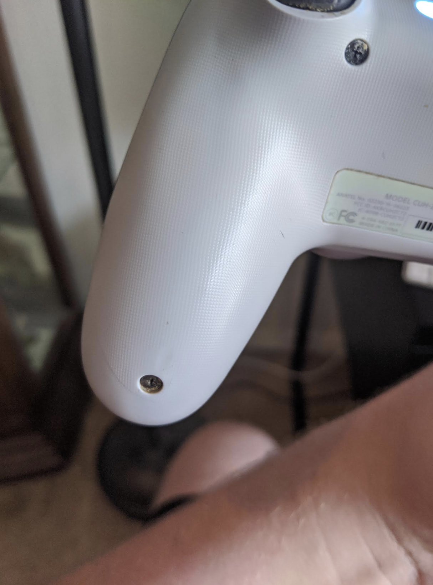

# CMPM163Labs

Lab 6: 

Point light: illuminates entirely around a point. Rotation doesn’t matter, while position does.
Directional light: provides ambient light in a particular direction. Position doesn’t matter, while rotation does.
Spotlight: Is a… well, spotlight, with both position and rotation mattering to illuminate the cone.
Area light: is a baked light source that illuminates everything on one side of a square plane. 

The first photo is of the backside of a dualshock 4, the second photo is it zoomed in. The third is a color modification I did to make it resemble an appropriate normal map, and the last photo is how it turned out!

For the textures, I just look up “cool textures”. One looks like a painting, the other like a marbled ink splot.

I also made a basic, weird, purple skybox!

Lab 5: https://drive.google.com/file/d/1LsFdQZzBZn2YVF9f95iWQCNIiz5edvNM/view?usp=sharing

I followed the tutorial (for the most part) and modified the materials on some objects.

Lab 4: https://drive.google.com/file/d/1L3AxlbSJFUyt9_EVeuteFes7PL35ASAz/view?usp=sharing

I made the cubes by following the assignment's instructions. I made the fifth cube my modulo-ing
the vUv. That was... rough.

The answer for A and B are basically the same. You take it, 
multiply it by 8, and round down to the nearest whole number. 
White.

Lab 3: https://drive.google.com/file/d/1LPCcJeBJhAoMQ2DWJJDh8ULOW6k8Iy28/view?usp=sharing

The top cube's shader was done by messing around with the variables in fragShader.
Everything else was done as the tutorial specified. 

Lab 2: https://drive.google.com/file/d/113hF4LND7Cfw_db47R8Z1l-rE23QKpEI/view?usp=sharing

